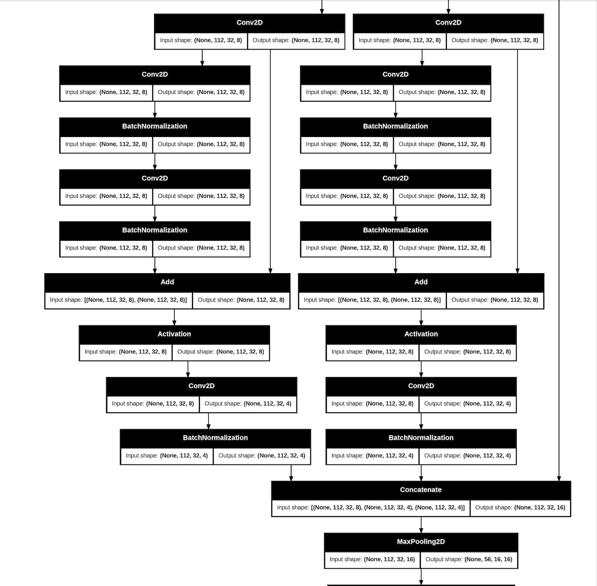

# Eye-movement-Tracker
Fast CNN to track eye-movement with the purpose of executing the model on Raspberry Pi

# Light-weight Convolutional Neural Network for Eye-Detection on Raspberry Pi

## Abstract
In this project, we develop a lightweight Convolutional Neural Network for eye-detection on a Raspberry Pi device. Due to the limited computational power of the Raspberry Pi's CPU, the network architecture focuses on reducing computational cost while maintaining adequate performance in tracking eye movements. This report details the methodology, network design, and results of the model, which achieves a balance between performance and computational efficiency.

## Introduction
This project aims to create a model capable of detecting eye movements on a Raspberry Pi, which relies on a CPU with limited processing capabilities. Traditional models with high accuracy often require more computational resources, which led us to design a lightweight model. Our approach combines elements from Inception and ResNet architectures to optimize both the parameter count and detection performance.

## Methodology
To address the limited resources of the Raspberry Pi, we leverage the Inception network's efficiency and augment it with ResNet blocks. This combination reduces the parameter count without a significant loss in performance. A trade-off was established to achieve a satisfactory balance where the model can track eye movement while maintaining a manageable size in terms of parameters.

## Network Architecture
The network structure incorporates ResNet blocks within Inception modules to maximize efficiency. Below are the parameter details of the network:

* Total parameters: 44,260 (172.89 KB)
* Trainable parameters: 43,940 (171.64 KB)
* Non-trainable parameters: 320 (1.25 KB)

The complete architecture can be found in the `InceptionResNet.py` file. In the picture below, you can see one block of InceptionResNet network architecture.

## Demo
Below is a demonstration of the eye movement tracking. The model effectively captures and displays eye movement in real-time:

## Conclusion
The project demonstrates a successful implementation of a lightweight CNN for eye movement detection on a Raspberry Pi. By merging Inception and ResNet components, we managed to optimize the network for CPU performance while maintaining functionality. Future work could involve further refinement of the network architecture or testing on other resource-constrained devices.

## Installation
[Add installation instructions here]

## Usage
[Add usage instructions here]

## Requirements
[Add requirements here]

## License
[Add license information here]

## Contributing
[Add contribution guidelines here]

## Contact
[Add contact information here]
